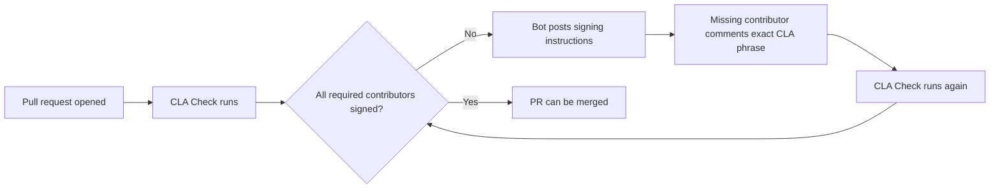

# CLA Bot

GitHub Action that blocks pull requests until each required contributor signs your CLA by posting an exact PR comment.

## Quick Start

1. Create a registry repository, for example `overtrue/cla-registry`.
2. Add `.github/cla.yml` to the target repository.
3. Add `.github/workflows/cla.yml` to the target repository.
4. If the registry repository is different from the target repository, add a secret named `CLA_BOT_REGISTRY_TOKEN`.
5. Open a pull request. The bot will post signing instructions when a signature is missing.

If you build or test this repository locally, use Node 24.

## How It Works



## Add `.github/cla.yml`

The file does not need to be fully specified. This is the smallest useful config:

```yaml
document:
  version: v1
  url: https://example.com/cla/v1

registry:
  type: issue
  repository: overtrue/cla-registry
```

Everything else falls back to sensible defaults.

Full example using the issue backend:

```yaml
enabled: true

document:
  version: v1
  url: https://example.com/cla/v1

signing:
  mode: comment
  comment_pattern: I have read and agree to the CLA.
  case_insensitive: true
  trim_whitespace: true

contributors:
  check_pr_author: true
  check_commit_authors: true
  check_coauthors: false
  exclude_bots: true
  allowlist:
    - dependabot[bot]
    - github-actions[bot]

registry:
  type: issue
  repository: overtrue/cla-registry

status:
  check_name: CLA Check
  comment_tag: <!-- cla-bot -->
```

Copy-ready examples:

- [Issue backend](./examples/cla.yml)
- [JSON backend](./examples/cla.json-repo.yml)

## Add `.github/workflows/cla.yml`

If the registry repository is separate from the target repository:

```yaml
name: CLA Check

on:
  pull_request_target:
    types: [opened, synchronize, reopened]
  issue_comment:
    types: [created]

permissions:
  contents: write
  pull-requests: write
  issues: write
  checks: write

jobs:
  cla:
    runs-on: ubuntu-latest
    steps:
      - uses: actions/checkout@v4
      - name: Run CLA Bot
        uses: overtrue/cla-bot@v0.0.1
        with:
          github-token: ${{ github.token }}
          registry-token: ${{ secrets.CLA_BOT_REGISTRY_TOKEN }}
```

If the registry is the same repository, `github.token` is enough:

```yaml
name: CLA Check

on:
  pull_request_target:
    types: [opened, synchronize, reopened]
  issue_comment:
    types: [created]

permissions:
  contents: write
  pull-requests: write
  issues: write
  checks: write

jobs:
  cla:
    runs-on: ubuntu-latest
    steps:
      - uses: actions/checkout@v4
      - name: Run CLA Bot
        uses: overtrue/cla-bot@v0.0.1
        with:
          github-token: ${{ github.token }}
```

Copy-ready examples:

- [Cross-repo registry workflow](./examples/workflow.yml)
- [Same-repo registry workflow](./examples/workflow.same-repo.yml)

## How Contributors Sign

When a PR is missing signatures, the bot posts a comment listing the missing contributors.

Each missing contributor must comment exactly:

```text
I have read and agree to the CLA.
```

By default the bot checks:

- the PR author
- all commit authors

## Choose a Registry Backend

Use `issue` if you want the simplest setup and easy manual inspection.

```yaml
registry:
  type: issue
  repository: overtrue/cla-registry
```

Use `json-repo` if you want one JSON file per signer.

```yaml
registry:
  type: json-repo
  repository: overtrue/cla-registry
  path_prefix: signatures
```

## Token Setup

`github-token`

- Required.
- Used to read the target repository and update PR comments and checks.
- In workflows, use `${{ github.token }}`.

`registry-token`

- Optional.
- Needed when the registry repository is different from the target repository.
- Must have write access to the registry repository.
- A fine-grained PAT is the simplest option.

## Use with AI

If you want an AI coding tool to integrate CLA Bot for you, give it this prompt and adjust the repository names:

```text
Integrate CLA Bot into this repository.

Requirements:
- Create or use the registry repository: overtrue/cla-registry
- Use the issue backend
- Add .github/cla.yml with the minimal working config
- Add .github/workflows/cla.yml for pull_request_target and issue_comment
- Use github.token for github-token
- Use CLA_BOT_REGISTRY_TOKEN as the secret for registry-token if the registry repository is separate
- Keep the setup simple and do not add extra features
- Update README or workflow comments only if needed to explain setup

After the changes:
- summarize what was added
- list any required GitHub secrets
- explain how contributors sign the CLA
```

For a same-repo registry, tell the AI to omit `registry-token` and point `registry.repository` at the current repository.

## Common Questions

Why is the PR still blocked after someone signed?

- Another required contributor is still missing.
- The comment text does not match the configured signing phrase.
- The repository now requires a newer CLA version.

Why was no signature record written?

- `registry.repository` points to the wrong repository.
- `registry-token` is missing or cannot write to the registry repository.

Can I change the signing phrase?

- Yes. Set `signing.comment_pattern` in `.github/cla.yml`.
- Contributors must match that phrase exactly, subject to your `case_insensitive` and `trim_whitespace` settings.

## License

Licensed under the [MIT License](./LICENSE).
